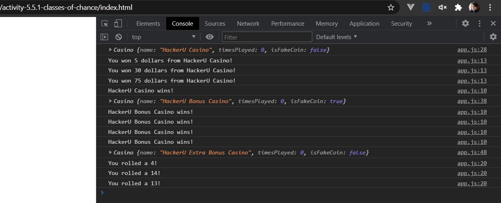

# Activity: Classes Of Chance

Create a Casino class that allows users to bet on a game of chance

Opening the index.html in your browser and viewing the console should look like this when you are done and you uncomment all the tests:



## Directions

You just opened a casino and are introducing a brand new game of change to your customers.

Our game will be a simple coin flipping game that encourages customers to play for longer by increasing the reward with each consecutive game they play.

1. Create a **Casino** class that takes a **name** as input to it's constructor.
2. Add another field called **timesPlayed** that has a default value of 0.
3. Create a method called **playGame(betAmount)** that checks if **Math.random() is less than or equal to 0.5**. If true, console.log that the name of the casino wins. If false, say the player wins the bet amount.
4. When the player wins increment the **timesPlayed** by one. Then, when the player wins, change the amount they won to equal: **betAmount * (this.timesPlayed + 1)**.

```js
const myCasino = new Casino("HackerU Casino");
myCasino.playGame(5);
> You won 5 dollars from HackerU Casino!
myCasino.playGame(5);
> You won 10 dollars at the HackerU Casino!
myCasino.playGame(5);
> HackerU Casino wins!
```

### BONUS

Add a **isFakeCoin** field to your class and always have the casino win every time when the isFakeCoin is set to true.

```js
const myBonusCasino = new BonusCasino("HackerU Casino", true);
myBonusCasino.playGame(5);
> HackerU Casino wins!
myBonusCasino.playGame(66);
> HackerU Casino wins!
myBonusCasino.playGame(66);
> HackerU Casino wins!
```

### EXTRA BONUS

Add another function called **rollDie(d)** that console.logs what you get when you roll a die that has "d" sides.
**NOTE**: We definitely used google to get the equation for this when we designed the curriculum. Don't be afraid to search!

```js
const myEBCasino = new ExtraBonusCasino("HackerU Casino", false);
myEBCasino.rollDie();
> You rolled a 2!
myEBCasino.rollDie();
> You rolled a 1!
myEBCasino.rollDie();
> You rolled a 3!
myEBCasino.rollDie();
> You rolled a 6!
myEBCasino.rollDie();
> You rolled a 5!
```

> By adding more methods and fields to this class you could simulate drawing a card from a deck, and then you could hypothetically build just about any card game with just a bit more math!
